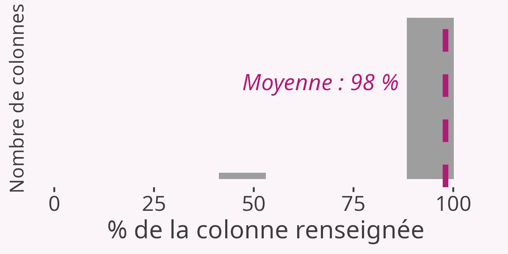
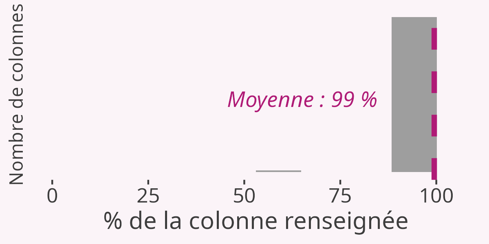
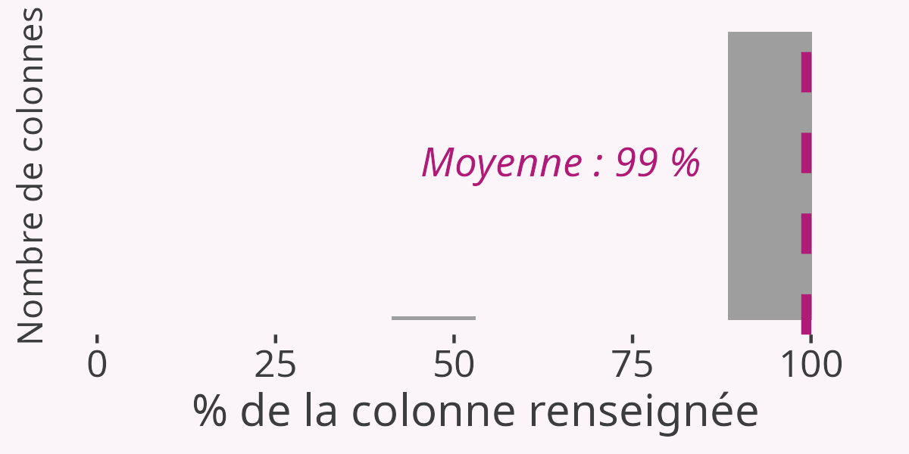

```{=html}
<style>

.summarytable th {
    padding-bottom: 40px;
    text-align: center;
}

</style>
```

```{r}
#| label: logo

# Logo haut de page
htmltools::img(src = "files/logos.png", 
               alt = 'logo', 
               style = 'position:absolute; top:0; left:0.4; padding-top:200px;') #padding=taille des espaces autour
```

<br>

<br>

<br>

# Introduction {.unnumbered}

Ce rapport d'analyse montre la qualité des données d'éducation publiées sur le portail open data du *Ministère de l'Éducation Nationale* (MEN) [data.education.gouv.fr](https://data.education.gouv.fr/pages/accueil/).

L'analyse de qualité porte sur les 30 jeux de données les plus populaires parmi les 345 disponibles au 25 février 2026 (en ayant exclu les sujets circonstanciels). Les jeux sont les suivants : 

- Annuaire de l'éducation ;
- Adresse et géolocalisation des établissements des premier et second degrés ;
- Établissements fermés ;
- Effectifs d’élèves par école ;
- Effectifs d’élèves en collège ;
- Effectifs d’élèves en lycée d'enseignement général et technologique ;
- Effectifs d’élèves en lycée professionnel ;
- Effectifs des élèves en voie professionnelle ou BTS ;
- Mode d'hébergement des élèves dans les établissements du second degré ;
- Le baccalauréat par académie ;
- Réussite au baccalauréat par département ;
- Réussite au baccalauréat selon l’origine sociale ;
- Proportion de bacheliers dans une génération ;
- Diplôme national du brevet par département, série et sexe ;
- Résultats détaillés au DNB ;
- Candidats au CAP par département et sexe ;
- Résultats par spécialité, sexe, statut et département au CAP ;
- Indicateurs de ségrégation sociale entre collèges dans les départements ;
- Indicateurs d'encadrement H/E et E/S à la rentrée dans le secteur public ;
- Indicateurs d'encadrement H/E et E/S à la rentrée dans le secteur privé sous contrat ;
- Offre de langues dans les collèges et lycées ;
- Sections internationales et classes menant au baccalauréat français international (BFI) ;
- DNMA - Métriques par UAI croisées par les profils ;
- DNMA - Métriques par UAI croisées par les services ;
- DNMA - Métriques par UAI croisées par les appareils ;
- Pix - Résultats par palier des parcours de rentrée pour les élèves des collèges et lycées ;
- Effectifs dans les enseignements de spécialité en Première générale ;
- Carte scolaire des collèges publics ;
- Établissements labellisés Euroscol ;
- Sections Sportives Scolaires.

<br>

L'**analyse de la qualité** des jeux de données se compose de deux éléments : 

- **aperçu général** : une table offrant une vision globale du jeu de données avec pour chaque colonne ; son type, ses 5 premières valeurs et leur fréquence, le nombre et la part de valeurs manquantes ;
- **histogramme de complétude** : une visualisation sous forme d'histogramme montrant la distribution de la complétude de toutes les colonnes du jeu de données. Plus la distribution se situe vers la droite, plus les colonnes sont renseignées à 100% (peu de valeurs manquantes).
  
<br>
  


```{r}
# Packages
library(tidyverse)
library(summarytools)
library(janitor)
library(gt)
library(gtExtras)
library(plotly)
library(htmltools)

# Thème pour les graphiques
theme_custom <- function (){
    ggplot2::theme(plot.title = ggplot2::element_text(size = 15, face = "bold", color = "#222222"), 
        axis.text = ggplot2::element_text(size = 9, color = "#222222"), 
        axis.text.x = ggplot2::element_text(margin = ggplot2::margin(5,b = 10)), 
        axis.title = ggplot2::element_text(size = 11, color = "#222222"),
        axis.ticks = ggplot2::element_blank(),
        axis.line = ggplot2::element_blank(), 
        panel.grid.minor = ggplot2::element_blank(),
        panel.grid.major.y = ggplot2::element_line(color = "#cbcbcb"),
        panel.grid.major.x = ggplot2::element_blank(), 
        panel.background = ggplot2::element_blank(),
        strip.background = ggplot2::element_rect(fill = "white"),
        strip.text = ggplot2::element_text(size = 22, hjust = 0, face = "bold"),
        text = element_text(family = "Open Sans"))
}
```


# Annuaire de l'éducation


```{r}
data <- read_delim("https://data.education.gouv.fr/api/explore/v2.1/catalog/datasets/fr-en-annuaire-education/exports/csv?lang=fr&timezone=Europe%2FParis&use_labels=true&delimiter=%3B", ";")
```

Ce jeu se compose de `r format(nrow(data), nsmall = 1, big.mark = ".")` lignes et `r ncol(data)` colonnes. 

```{r}
#| eval: false
#| include: false

# Exploration des données pour l'audit qualitatif
n_distinct(data$Identifiant_de_l_etablissement)
test <- data |> 
  mutate(n=n(), .by = Identifiant_de_l_etablissement) |> 
  arrange(desc(n), Identifiant_de_l_etablissement)
sub <- test |> 
  filter(n>1)
n_distinct(sub$Identifiant_de_l_etablissement)

# Lebourg
lebourg <- data |> 
  filter(Adresse_1 == "LEBOURG") |> 
  select(Adresse_1, precision_localisation)

# Nb digits num tel
test <- data |> 
  select(Telephone) |> 
  mutate(nb_digits = str_count(Telephone, "\\d")) |> 
  tabyl(nb_digits)

# Vérif mails
test <- data |> 
  distinct(Mail) |> 
  mutate(valide = str_detect(Mail, "^[a-zA-Z0-9._%+-]+@[a-zA-Z0-9.-]+\\.[a-zA-Z]{2,}$"))

# NA type
data |> 
  filter(is.na(Statut_public_prive)) |> 
  tabyl(Type_etablissement)

# regarder les "LEBOURG" quelle precision_localisation est renseignée
# regarder les doublons UAI quel etat ? A fermer / ouvert, et multi_uai
```


## Aperçu général

```{r}
apercu_dfsummary <- function(df){
  print(dfSummary(df,
                style = "grid", graph.magnif = 1, 
                valid.col = FALSE, varnumbers = FALSE, tmp.img.dir = "/tmp", 
                max.distinct.values = 5, headings = FALSE, method = "render", 
                col.widths  = c(300, 200, 100, 50, 20)),
      max.tbl.height = 600,
      method = "render")
}
apercu_dfsummary(data)
```


## Histogramme de complétude

```{r}
histo_completude <- function(df, xlabel, ylabel, nom_export){
  
  #Calcul des stats de complétude
  nb_NA <- as.data.frame(colSums(!is.na(df))) |>
      setNames("Nombre de valeurs renseignées") |>
      rownames_to_column("Champs") |>
      mutate(`% de la colonne renseignée` = round(`Nombre de valeurs renseignées`/nrow(df)*100, 2)) |>
      arrange(desc(`% de la colonne renseignée`)) |>
      (\(x) bind_rows(x,
        summarise(x, Champs = "Complétude moyenne",
                  `Nombre de valeurs renseignées` = mean(`Nombre de valeurs renseignées`),
                  `% de la colonne renseignée` = mean(`% de la colonne renseignée`))
      ))() |>
      mutate(`Nombre de valeurs renseignées` = format(as.integer(`Nombre de valeurs renseignées`), 
                                                     nsmall = 1, big.mark = "."))
  
  #Mise en graphique
  hist <- nb_NA |> 
    ggplot() +
    geom_histogram(aes(x = `% de la colonne renseignée`), 
                   fill = "#9E9E9E", bins = 10) +
    geom_vline(xintercept = mean(nb_NA$`% de la colonne renseignée`, na.rm = TRUE), 
               linetype = 2, size = 1.5, col = "#af1b76ff") +
    geom_label(aes(x = mean(`% de la colonne renseignée`, na.rm = T) - xlabel, y = ylabel, 
                      label = paste("Moyenne :", round(mean(`% de la colonne renseignée`, na.rm = T), 0), "%")), 
                  col = "#af1b76ff", fill = "#fbf4f8ff", label.size = NA, 
               fontface = "italic", hjust = 1, size = 4.5) +
    xlim(0, 106) +
    labs(y = "Nombre de colonnes") +
    theme_classic() +
    theme(axis.title.y = element_text(size = 11, colour = "#3d3d3d"),
          axis.title.x = element_text(size = 14, colour = "#3d3d3d"),
          axis.ticks.y = element_blank(),
          axis.ticks.x = element_line(colour = "#3d3d3d"),
          axis.line = element_blank(),
          axis.text.y = element_blank(),
          axis.text.x = element_text(size = 12, colour = "#3d3d3d"),
          plot.background = element_rect(fill = "#fbf4f8ff", colour = "#fbf4f8ff"),
          panel.background = element_rect(fill = "#fbf4f8ff", colour = "#fbf4f8ff"))
  
  # Export
  ggsave(file = paste0("./files/histo_completude/hist", nom_export, ".png"), 
         plot = hist, width = 4, height = 2)
  hist
}
histo_completude(data, 2, 15, "1_annuaire")# |> 
  #theme(plot.background = element_rect(fill = "white", colour = "white"),
        #panel.background = element_rect(fill = "white", colour = "white"))
```


<br>

# Adresse et géolocalisation des établissements d’enseignement des premier et second degrés


```{r}
data <- read_delim("https://data.education.gouv.fr/api/explore/v2.1/catalog/datasets/fr-en-adresse-et-geolocalisation-etablissements-premier-et-second-degre/exports/csv?lang=fr&timezone=Europe%2FParis&use_labels=true&delimiter=%3B", ";")
```

Ce jeu se compose de `r format(nrow(data), nsmall = 1, big.mark = ".")` lignes et `r ncol(data)` colonnes. 

```{r}
#| eval: false
#| include: false
# Exploration des données pour l'audit qualitatif
test <- tabyl(data$`Libellé de la nature de l'UAI`)
test <- data |> filter(is.na(`Adresse : désignation de la voie`))
```


## Aperçu général

```{r}
apercu_dfsummary(data)
```

## Histogramme de complétude

```{r}
histo_completude(data, 6, 15, "2_adresse")
```


<br>

# Établissements fermés


```{r}
data <- read_delim("https://data.education.gouv.fr/api/explore/v2.1/catalog/datasets/fr-en-etablissements-fermes/exports/csv?lang=fr&timezone=Europe%2FParis&use_labels=true&delimiter=%3B", ";")
```

Ce jeu se compose de `r format(nrow(data), nsmall = 1, big.mark = ".")` lignes et `r ncol(data)` colonnes. 

```{r}
#| eval: false
#| include: false
# Exploration des données pour l'audit qualitatif
test <- data |> 
  filter(Ecole_maternelle == 1) |> 
  tabyl(Ecole_elementaire)
data |> 
  filter(Ecole_maternelle == 1) |> 
  tabyl(nature_uai_libe)
test <- data |> 
  select(appellation_officielle,denomination_principale,nature_uai_libe,Ecole_maternelle,Ecole_elementaire)
test <- data |> filter(is.na(localite_acheminement_uai))
test <- data |> select(code_postal_uai) |> mutate(nb_char = nchar(code_postal_uai))
```


## Aperçu général

```{r}
apercu_dfsummary(data)
```

## Histogramme de complétude

```{r}
histo_completude(data, 6, 15, "3_etablissements")
```


<br>

# Effectifs d’élèves par école


```{r}
data <- read_delim("https://data.education.gouv.fr/api/explore/v2.1/catalog/datasets/fr-en-ecoles-effectifs-nb_classes/exports/csv?lang=fr&timezone=Europe%2FParis&use_labels=true&delimiter=%3B", ";")
```

Ce jeu se compose de `r format(nrow(data), nsmall = 1, big.mark = ".")` lignes et `r ncol(data)` colonnes. 

```{r}
#| eval: false
#| include: false
# Exploration des données pour l'audit qualitatif
n_distinct(data$`Numéro de l'école`)
test <- tabyl(data$`Dénomination principale`) |> arrange(desc(n))
test <- data |> 
  select(`Nombre total d'élèves`:`Nombre d'élèves en CM2 hors ULIS`) |> 
  rowwise() |> 
  mutate(mon_total1 = `Nombre d'élèves en pré-élémentaire hors ULIS` + `Nombre d'élèves en élémentaire hors ULIS` + `Nombre d'élèves en ULIS`+`Nombre d'élèves en UEEA`,
         mon_total2 = `Nombre d'élèves en CM2 hors ULIS`+`Nombre d'élèves en CP hors ULIS`+`Nombre d'élèves en CE1 hors ULIS`+`Nombre d'élèves en CE2 hors ULIS`+`Nombre d'élèves en CM1 hors ULIS`) |> 
  #select(mon_total, `Nombre total d'élèves`) |> 
  mutate(different1 = ifelse(mon_total1 != `Nombre total d'élèves`, 1, 0),
         different2 = ifelse(mon_total2 != `Nombre total d'élèves`, 1, 0))
```


## Aperçu général

```{r}
apercu_dfsummary(data)
```

## Histogramme de complétude

```{r}
histo_completude(data, 12, 15, "4_effectifs-ecole")
```


<br>

# Effectifs d’élèves en collège


```{r}
data <- read_delim("https://data.education.gouv.fr/api/explore/v2.1/catalog/datasets/fr-en-college-effectifs-niveau-sexe-lv/exports/csv?lang=fr&timezone=Europe%2FParis&use_labels=true&delimiter=%3B", ";")
```

Ce jeu se compose de `r format(nrow(data), nsmall = 1, big.mark = ".")` lignes et `r ncol(data)` colonnes. 

```{r}
#| eval: false
#| include: false
# Exploration des données pour l'audit qualitatif
test <- data |> 
  select(REP, `REP +`) |> 
  mutate(is_both = ifelse(REP == 1 & `REP +` == 1, 1, 0)) |> 
  tabyl(is_both)
test
test <- data |> filter(is.na(`Code académie`))
tabyl(test$`Région académique`)
data |> 
  filter(`Région académique` == "LA REUNION") |> 
  nrow()
test <- data |> 
  filter(is.na(`Code commune`))
test <- data |> 
  filter(UAI == "0540060X")
```


## Aperçu général

```{r}
apercu_dfsummary(data)
```


## Histogramme de complétude

```{r}
histo_completude(data, 13, 25, "5_effectifs-college")
```


<br>

# Effectifs d'élèves en lycée d’enseignement général et technologique


```{r}
data <- read_delim("https://data.education.gouv.fr/api/explore/v2.1/catalog/datasets/fr-en-lycee_gt-effectifs-niveau-sexe-lv/exports/csv?lang=fr&timezone=Europe%2FParis&use_labels=true&delimiter=%3B", ";")
```

Ce jeu se compose de `r format(nrow(data), nsmall = 1, big.mark = ".")` lignes et `r ncol(data)` colonnes. 

```{r}
#| eval: false
#| include: false
# Exploration des données pour l'audit qualitatif
test <- data |> 
  mutate(mon_total = `2ndes GT` + `2ndes STHR` + `2ndes TMD` + `2ndes BT` + 
           `1ères G` + `1ères STI2D` + `1ères STL` + `1ères STMG` + 
           `1ères ST2S` + `1ères STD2A` + `1ères STHR` + `1ères TMD` + `1ères BT` +
           `Terminales G` + `Terminales STI2D` + `Terminales STL` + `Terminales STMG` + `Terminales ST2S` + 
           `Terminales STD2A` + `Terminales STHR` + `Terminales TMD` + `Terminales BT`,
         is_same = ifelse(mon_total == `Nombre d'élèves`, 1, 0)) |> 
  filter(is_same == 0)
n_distinct(test$UAI)
tabyl(test$is_same)
test <- data |> 
  tabyl(`Dénomination principale`)
```


## Aperçu général

```{r}
apercu_dfsummary(data)
```


## Histogramme de complétude

```{r}
histo_completude(data, 13, 50, "6_effectifs-lycee-techno")
```


<br>

# Effectifs d’élèves en lycée professionnel


```{r}
data <- read_delim("https://data.education.gouv.fr/api/explore/v2.1/catalog/datasets/fr-en-lycee_pro-effectifs-niveau-sexe-lv/exports/csv?lang=fr&timezone=Europe%2FParis&use_labels=true&delimiter=%3B", ";")
```

Ce jeu se compose de `r format(nrow(data), nsmall = 1, big.mark = ".")` lignes et `r ncol(data)` colonnes. 

```{r}
#| eval: false
#| include: false
# Exploration des données pour l'audit qualitatif
test <- data |> 
  tabyl(`Dénomination principale`)
```

## Aperçu général

```{r}
apercu_dfsummary(data)
```

## Histogramme de complétude

```{r}
histo_completude(data, 13, 35, "7_effectifs-lycee-pro")
```


<br>

# Effectifs des élèves en voie professionnelle ou BTS


```{r}
data <- read_delim("https://data.education.gouv.fr/api/explore/v2.1/catalog/datasets/fr-en-lycee_pro-effectifs-niveau-sexe-mef/exports/csv?lang=fr&timezone=Europe%2FParis&use_labels=true&delimiter=%3B", ";")
```

Ce jeu se compose de `r format(nrow(data), nsmall = 1, big.mark = ".")` lignes et `r ncol(data)` colonnes. 

```{r}
#| eval: false
#| include: false
# Exploration des données pour l'audit qualitatif
test <- data |> 
  tabyl(`Dénomination principale`)
```

## Aperçu général

```{r}
apercu_dfsummary(data)
```


## Histogramme de complétude

```{r}
histo_completude(data, 10, 15, "8_effectifs-BTS")
```


<br>

# Mode d’hébergement des élèves dans les établissements du second degré


```{r}
data <- read_delim("https://data.education.gouv.fr/api/explore/v2.1/catalog/datasets/fr-en-mode-hebergement-eleves-etablissements-2d/exports/csv?lang=fr&timezone=Europe%2FParis&use_labels=true&delimiter=%3B", ";")
```

Ce jeu se compose de `r format(nrow(data), nsmall = 1, big.mark = ".")` lignes et `r ncol(data)` colonnes. 


## Aperçu général

```{r}
apercu_dfsummary(data)
```


## Histogramme de complétude

```{r}
histo_completude(data, 13, 15, "9_mode")
```


<br>

# Le baccalauréat par académie


```{r}
data <- read_delim("https://data.education.gouv.fr/api/explore/v2.1/catalog/datasets/fr-en-baccalaureat-par-academie/exports/csv?lang=fr&timezone=Europe%2FParis&use_labels=true&delimiter=%3B", ";")
```

Ce jeu se compose de `r format(nrow(data), nsmall = 1, big.mark = ".")` lignes et `r ncol(data)` colonnes. 


## Aperçu général

```{r}
apercu_dfsummary(data)
```


## Histogramme de complétude

```{r}
histo_completude(data, 13, 15, "10_baccalaureat")
```


<br>

# Réussite au baccalauréat par département


```{r}
data <- read_delim("https://data.education.gouv.fr/api/explore/v2.1/catalog/datasets/fr-en-baccalaureat-par-departement/exports/csv?lang=fr&timezone=Europe%2FParis&use_labels=true&delimiter=%3B", ";")
```

Ce jeu se compose de `r format(nrow(data), nsmall = 1, big.mark = ".")` lignes et `r ncol(data)` colonnes. 

```{r}
#| eval: false
#| include: false
# Exploration des données pour l'audit qualitatif
test <- data |> 
  mutate(taux = round(`Nombre d'admis à l'examen` / `Nombre de présents à l'examen` * 100, 1), 
         is_same = ifelse(taux == `Taux de réussite à l'examen`, 1, 0))
tabyl(test$is_same)
test <- tabyl(data$`Libellé département`)
test <- tabyl(data$`Libellé académie`)
```


## Aperçu général

```{r}
apercu_dfsummary(data)
```


## Histogramme de complétude

```{r}
histo_completude(data, 13, 7, "11_reussite-departement")
```


<br>

# Réussite au baccalauréat selon l’origine sociale


```{r}
data <- read_delim("https://data.education.gouv.fr/api/explore/v2.1/catalog/datasets/fr-en-reussite-au-baccalaureat-origine-sociale/exports/csv?lang=fr&timezone=Europe%2FParis&use_labels=true&delimiter=%3B", ";")
```

Ce jeu se compose de `r format(nrow(data), nsmall = 1, big.mark = ".")` lignes et `r ncol(data)` colonnes. 

```{r}
#| eval: false
#| include: false
# Exploration des données pour l'audit qualitatif
library(janitor)
tabyl(data$Année)
tabyl(data$`Origine sociale`)
test <- data |> 
  filter(`Origine sociale` != "Ensemble") |> 
  group_by(Année) |> 
  group_modify(~ adorn_totals(.x, where = "row")) |> 
  ungroup() |> 
  arrange(fct_relevel(`Origine sociale`, 'Total')) |> 
  filter(`Origine sociale` == "Total")
test2 <- test |> 
  bind_rows(data |> filter(`Origine sociale` == "Ensemble")) |> 
  arrange(Année)
```


## Aperçu général

```{r}
apercu_dfsummary(data)
```


## Histogramme de complétude

```{r}
histo_completude(data, 13, 7, "12_reussite-origine")
```


<br>

# La proportion de bacheliers dans une génération


```{r}
data <- read_delim("https://data.education.gouv.fr/api/explore/v2.1/catalog/datasets/fr-en-proportion-de-bacheliers-dans-une-generation/exports/csv?lang=fr&timezone=Europe%2FParis&use_labels=true&delimiter=%3B", ";")
```

Ce jeu se compose de `r format(nrow(data), nsmall = 1, big.mark = ".")` lignes et `r ncol(data)` colonnes. 

```{r}
#| eval: false
#| include: false
# Exploration des données pour l'audit qualitatif
data |> 
  mutate(n = n(), .by = Année) |>
  arrange(desc(n)) |> 
  tabyl(n)
data |> 
  filter(Série == "Bac professionnel") |> 
  filter(Année == min(Année))
n_distinct(data$Année)
summary(data$`Pourcentage de garçons bacheliers dans une génération`)
summary(data$`Pourcentage de filles bachelières dans une génération`)
summary(data$`Pourcentage de bacheliers dans une génération`)
```


## Aperçu général

```{r}
apercu_dfsummary(data)
```


## Histogramme de complétude

```{r}
histo_completude(data, 2, 3, "13_proportion")
```


<br>

# Candidats au DNB par département, série et sexe


```{r}
data <- read_delim("https://data.education.gouv.fr/api/explore/v2.1/catalog/datasets/fr-en-dnb-par-departement/exports/csv?lang=fr&timezone=Europe%2FParis&use_labels=true&delimiter=%3B", ";")
```

Ce jeu se compose de `r format(nrow(data), nsmall = 1, big.mark = ".")` lignes et `r ncol(data)` colonnes. 

```{r}
#| eval: false
#| include: false
# Exploration des données pour l'audit qualitatif
test <- data |> 
  mutate(part_recus = round(Admis / Présents * 100, 1)) |> 
  filter(part_recus != `Taux de réussite`)
65/80
299/368
tabyl(data$Année)
```


## Aperçu général

```{r}
apercu_dfsummary(data)
```


## Histogramme de complétude

```{r}
histo_completude(data, 13, 10, "14_diplome")
```


<br>

# Résultats détaillés au DNB


```{r}
data <- read_delim("https://data.education.gouv.fr/api/explore/v2.1/catalog/datasets/fr-en-resultats-detailles-au-dnb/exports/csv?lang=fr&timezone=Europe%2FParis&use_labels=true&delimiter=%3B", ";")
```

Ce jeu se compose de `r format(nrow(data), nsmall = 1, big.mark = ".")` lignes et `r ncol(data)` colonnes. 

```{r}
#| eval: false
#| include: false
# Exploration des données pour l'audit qualitatif
test <- data |> 
  filter_at(vars(ends_with("filles")), is.na)
test <- tabyl(data$`Libellé département`)
```

## Aperçu général

```{r}
apercu_dfsummary(data)
```


## Histogramme de complétude

```{r}
histo_completude(data, 10, 15, "15_resultats-DNB")
```


<br>

# Candidats au CAP par département et sexe


```{r}
data <- read_delim("https://data.education.gouv.fr/api/explore/v2.1/catalog/datasets/fr-en-cap-par-departement/exports/csv?lang=fr&timezone=Europe%2FParis&use_labels=true&delimiter=%3B", ";")
```

Ce jeu se compose de `r format(nrow(data), nsmall = 1, big.mark = ".")` lignes et `r ncol(data)` colonnes. 

```{r}
#| eval: false
#| include: false
# Exploration des données pour l'audit qualitatif
data |> select(-num_ligne) |> distinct() |> nrow()
test <- data |> 
  select(-num_ligne) |>
  mutate(n = n(), .by = everything()) |>
  arrange(desc(n))
data |> 
  mutate(taux = round(Admis / Présents * 100, 1)) |> 
  filter(`Taux de réussite` != taux) #même chose, c'est juste l'arrondi à 0,5 qui est fait à la baisse en R et à la hausse par la DEPP
table(data$Département, data$Année)

```


## Aperçu général

```{r}
apercu_dfsummary(data)
```


## Histogramme de complétude

```{r}
histo_completude(data, 13, 7, "16_candidats")
```


<br>

# Résultats par spécialité, sexe, statut et département au CAP


```{r}
data <- read_delim("https://data.education.gouv.fr/api/explore/v2.1/catalog/datasets/fr-en-cap_specialite_sexe_statut_departement/exports/csv?lang=fr&timezone=Europe%2FParis&use_labels=true&delimiter=%3B", ";")
```

Ce jeu se compose de `r format(nrow(data), nsmall = 1, big.mark = ".")` lignes et `r ncol(data)` colonnes. 

```{r}
#| eval: false
#| include: false
# Exploration des données pour l'audit qualitatif
test <- data |> 
  tabyl(Spécialité)
test <- data |> 
  tabyl(Statut)
tabyl(data$Année)
data |> 
  mutate(Admis = as.numeric(str_replace(Admis, "n.s", NA_character_)),
         Présents = as.numeric(str_replace(Présents, "n.s", NA_character_)),
         taux = round(Admis / Présents * 100, 1)) |> 
  filter(`Taux de réussite` != taux) 
```

## Aperçu général

```{r}
apercu_dfsummary(data)
```


## Histogramme de complétude

```{r}
histo_completude(data, 13, 10, "17_resultats-CAP")
```


<br>

# Indicateurs de ségrégation sociale entre collèges dans les départements


```{r}
data <- read_delim("https://data.education.gouv.fr/api/explore/v2.1/catalog/datasets/fr-en-indicateur_segregation_sociale_colleges/exports/csv?lang=fr&timezone=Europe%2FParis&use_labels=true&delimiter=%3B", ";")
```

Ce jeu se compose de `r format(nrow(data), nsmall = 1, big.mark = ".")` lignes et `r ncol(data)` colonnes. 

```{r}
#| eval: false
#| include: false
# Exploration des données pour l'audit qualitatif
data |> 
  mutate(tot = nb_coll_PU_calcul+nb_coll_PR_calcul) |> 
  filter(tot != nb_coll_calcul)
data |> 
  mutate(tot = p_tfav+p_fav+p_moy+p_defav) |> 
  filter(tot <= 99.9 & tot >= 100.1)
data |> 
  mutate(tot = contrib_pu+contrib_pr+contrib_interPUPR) |> 
  filter(tot <= 99.9 & tot >= 100.1)
```

## Aperçu général

```{r}
apercu_dfsummary(data)
```


## Histogramme de complétude

```{r}
histo_completude(data, 10, 15, "18_indicateurs-segregation")
```


<br>

# Indicateurs d'encadrement H/E et E/S à la rentrée dans le secteur public


```{r}
data <- read_delim("https://data.education.gouv.fr/api/explore/v2.1/catalog/datasets/fr-en-moyens_enseignants_2d_public/exports/csv?lang=fr&timezone=Europe%2FParis&use_labels=true&delimiter=%3B", ";")
```

Ce jeu se compose de `r format(nrow(data), nsmall = 1, big.mark = ".")` lignes et `r ncol(data)` colonnes. 

```{r}
#| eval: false
#| include: false
# Exploration des données pour l'audit qualitatif
test <- data |> 
  tabyl(Niveau) |> 
  desc(n) #3lignes pour Total Académie NORMANDIE
data |> 
  filter(`Numérateur H/E : nombre d’heures d’enseignement hebdomadaire devant élèves.` != "ns") |> 
  mutate(tot = as.numeric(`Numérateur H/E : nombre d’heures d’enseignement hebdomadaire devant élèves.`) / as.numeric(`Dénominateur H/E : somme des élèves en division.`)) |> 
  filter(round(tot, 2) != `H/E`)
test <- data |> 
  tabyl(`H/E`)
```

## Aperçu général

```{r}
apercu_dfsummary(data)
```


## Histogramme de complétude

```{r}
histo_completude(data, 13, 10, "19_indicateurs-public")
```


<br>

# Indicateurs d'encadrement H/E et E/S à la rentrée dans le secteur privé sous contrat


```{r}
data <- read_delim("https://data.education.gouv.fr/api/explore/v2.1/catalog/datasets/fr-en-moyens_enseignants_2d_prive/exports/csv?lang=fr&timezone=Europe%2FParis&use_labels=true&delimiter=%3B", ";")
```

Ce jeu se compose de `r format(nrow(data), nsmall = 1, big.mark = ".")` lignes et `r ncol(data)` colonnes. 

```{r}
#| eval: false
#| include: false
# Exploration des données pour l'audit qualitatif
test <- data |> 
  tabyl(Niveau) #1 ligne pour Prépa seconde
data |> 
  filter(`Numérateur H/E: nombre d’heures d’enseignement hebdomadaire devant élèves.` != "ns") |> 
  mutate(tot = as.numeric(`Numérateur H/E: nombre d’heures d’enseignement hebdomadaire devant élèves.`) / as.numeric(`Dénominateur H/E: somme des élèves en division.`)) |> 
  filter(round(tot, 2) != `H/E`)
data |> 
  filter(`Numérateur E/S: nombre d’élèves d’une structure pondéré par le nombre d’heures d’enseignement dans cette structure` != "ns") |> 
  mutate(tot = as.numeric(`Numérateur E/S: nombre d’élèves d’une structure pondéré par le nombre d’heures d’enseignement dans cette structure`) / as.numeric(`Dénominateur E/S: nombre d’heures d’enseignement hebdomadaire devant élèves.`)) |> 
  filter(round(tot, 2) != `E/S`)
```

## Aperçu général

```{r}
apercu_dfsummary(data)
```


## Histogramme de complétude

```{r}
histo_completude(data, 13, 10, "20_indicateurs-prive")
```


<br>

# Offre de langues dans les collèges et lycées


```{r}
data <- read_delim("https://data.education.gouv.fr/api/explore/v2.1/catalog/datasets/fr-en-offre-langues-2d/exports/csv?lang=fr&timezone=Europe%2FParis&use_labels=true&delimiter=%3B", ";")
```

Ce jeu se compose de `r format(nrow(data), nsmall = 1, big.mark = ".")` lignes et `r ncol(data)` colonnes. 

```{r}
#| eval: false
#| include: false
# Exploration des données pour l'audit qualitatif
test <- data |> 
  tabyl(Langues)
test <- data |> 
  filter(!is.na(Département) & is.na(`Code departement`))
```

## Aperçu général

```{r}
apercu_dfsummary(data)
```


## Histogramme de complétude

```{r}
histo_completude(data, 13, 10, "21_offre")
```


<br>

# Sections internationales et classes menant au baccalauréat français international (BFI)


```{r}
data <- read_delim("https://data.education.gouv.fr/api/explore/v2.1/catalog/datasets/fr-en-sections-internationales/exports/csv?lang=fr&timezone=Europe%2FParis&use_labels=true&delimiter=%3B", ";")
```

Ce jeu se compose de `r format(nrow(data), nsmall = 1, big.mark = ".")` lignes et `r ncol(data)` colonnes. 

```{r}
#| eval: false
#| include: false
# Exploration des données pour l'audit qualitatif
test <- data |> 
  tabyl(Academie)
test <- data |> 
  tabyl(Section)
test <- data |> 
  filter(!is.na(Département) & is.na(`Code departement`))
```

## Aperçu général

```{r}
apercu_dfsummary(data)
```


## Histogramme de complétude

```{r}
histo_completude(data, 2, 5, "22_sections-BFI")
```


<br>

# DNMA - Métriques par UAI croisées par les profils


```{r}
#| eval: false
#| include: false
curl::curl_download("https://data.education.gouv.fr/api/explore/v2.1/catalog/datasets/fr-en-dnma-par-uai-profils/exports/csv?lang=fr&timezone=Europe%2FParis&use_labels=true&delimiter=%3B", 
                    destfile = "data.csv")
data <- vroom::vroom("data.csv", delim = ";")
```

Ce jeu se compose de `r format(nrow(data), nsmall = 1, big.mark = ".")` lignes et `r ncol(data)` colonnes. 


## Aperçu général

```{r}
#| eval: false
#| include: false
#| label: prerun dfsummary profils
res <- dfSummary(data, plain.ascii = FALSE, max.distinct.values = 5)
saveRDS(res, "files/prerun_dfsummary_DNMA/dfsummary_DNMA-profils.rds")
```

```{r}
res <- readRDS("files/prerun_dfsummary_DNMA/dfsummary_DNMA-profils.rds")
print(res, method = "render", max.tbl.height = 600)
```

## Histogramme de complétude

```{r}
#| eval: false
#| include: false
histo_completude(data, 10, 15, "23_DNMA-profils")
```



<br>

# DNMA - Métriques par UAI croisées par les services


```{r}
#| eval: false
#| include: false
curl::curl_download("https://data.education.gouv.fr/api/explore/v2.1/catalog/datasets/fr-en-dnma-par-uai-services/exports/csv?lang=fr&timezone=Europe%2FParis&use_labels=true&delimiter=%3B", 
                    destfile = "data.csv")
data <- vroom::vroom("data.csv", delim = ";")
```

Ce jeu se compose de `r format(nrow(data), nsmall = 1, big.mark = ".")` lignes et `r ncol(data)` colonnes. 


## Aperçu général

```{r}
#| eval: false
#| include: false
#| label: prerun dfsummary services
res <- dfSummary(data, plain.ascii = FALSE, max.distinct.values = 5)
saveRDS(res, "files/prerun_dfsummary_DNMA/dfsummary_DNMA-services.rds")
```

```{r}
res <- readRDS("files/prerun_dfsummary_DNMA/dfsummary_DNMA-services.rds")
print(res, method = "render", max.tbl.height = 600)
```


## Histogramme de complétude

```{r}
#| eval: false
#| include: false
histo_completude(data, 13, 40, "24_DNMA-services")
```



<br>

# DNMA - Métriques par UAI croisées par les appareils


```{r}
#| eval: false
#| include: false
curl::curl_download("https://data.education.gouv.fr/api/explore/v2.1/catalog/datasets/fr-en-dnma-par-uai-appareils/exports/csv?lang=fr&timezone=Europe%2FParis&use_labels=true&delimiter=%3B", 
                    destfile = "data.csv")
data <- vroom::vroom("data.csv", delim = ";")
```

Ce jeu se compose de `r format(nrow(data), nsmall = 1, big.mark = ".")` lignes et `r ncol(data)` colonnes. 


## Aperçu général

```{r}
#| eval: false
#| include: false
#| label: prerun dfsummary appareils
res <- dfSummary(data, plain.ascii = FALSE, max.distinct.values = 5)
saveRDS(res, "files/prerun_dfsummary_DNMA/dfsummary_DNMA-appareils.rds")
```

```{r}
res <- readRDS("files/prerun_dfsummary_DNMA/dfsummary_DNMA-appareils.rds")
print(res, method = "render", max.tbl.height = 600)
```


## Histogramme de complétude

```{r}
#| eval: false
#| include: false
histo_completude(data, 13, 40, "25_DNMA-appareils")
```




<br>

# Pix - Résultats par palier des parcours de rentrée pour les élèves des collèges et lycées


```{r}
data <- read_delim("https://data.education.gouv.fr/api/explore/v2.1/catalog/datasets/fr-en-pix_resultats_des_campagnes_de_rentree_par_eple/exports/csv?lang=fr&timezone=Europe%2FParis&use_labels=true&delimiter=%3B", ";")
```

Ce jeu se compose de `r format(nrow(data), nsmall = 1, big.mark = ".")` lignes et `r ncol(data)` colonnes. 

```{r}
#| eval: false
#| include: false
# Exploration des données pour l'audit qualitatif
test <- data |> 
  filter(total_participants < total_envoi_par_niveau)
data |> 
  filter(total_participants >= total_envoi_par_niveau) |> 
  nrow()
tabyl(test$annee)
tabyl(data$niveau_scolaire)
```

## Aperçu général

```{r}
apercu_dfsummary(data)
```


## Histogramme de complétude

```{r}
histo_completude(data, 13, 15, "26_Pix")
```


<br>

# Effectifs dans les enseignements de spécialité en Première générale


```{r}
data <- read_delim("https://data.education.gouv.fr/api/explore/v2.1/catalog/datasets/fr-en-effectifs-specialites-triplettes-1ere-generale/exports/csv?lang=fr&timezone=Europe%2FParis&use_labels=true&delimiter=%3B", ";")
```

Ce jeu se compose de `r format(nrow(data), nsmall = 1, big.mark = ".")` lignes et `r ncol(data)` colonnes. 


```{r}
#| eval: false
#| include: false
# Exploration des données pour l'audit qualitatif

test <- data |> 
  tabyl(`DENOMINATION PRINCIPALE`)
data |> 
  mutate(tot = `EFFECTIF TOTAL FILLES` + `EFFECTIF TOTAL GARCONS`) |> 
  filter(tot != `EFFECTIF TOTAL`)
```


## Aperçu général

```{r}
apercu_dfsummary(data)
```


## Histogramme de complétude

```{r}
histo_completude(data, 13, 35, "27_effectifs-premiere")
```


<br>

# Carte scolaire des collèges publics


```{r}
data <- read_delim("https://data.education.gouv.fr/api/explore/v2.1/catalog/datasets/fr-en-carte-scolaire-colleges-publics/exports/csv?lang=fr&timezone=Europe%2FParis&use_labels=true&delimiter=%3B", ";")
```

Ce jeu se compose de `r format(nrow(data), nsmall = 1, big.mark = ".")` lignes et `r ncol(data)` colonnes. 

```{r}
#| eval: false
#| include: false
# Exploration des données pour l'audit qualitatif

test <- data |> 
  filter_out(parite %in% c("P", "I", "PI")) |> 
  filter(!is.na(parite))
data |> 
  select(-no_ligne) |> 
  distinct() |> 
  nrow()
data |> 
  filter(secteur_unique == "N" & is.na(No_de_voie_debut) & is.na(No_de_voie_fin)) |> 
  nrow()
data |> 
  filter(secteur_unique == "0" & !is.na(lieu_dit) & !is.na(type_et_libelle) & !is.na(No_de_voie_debut) & !is.na(No_de_voie_fin)) |> 
  nrow()
test <- data |> 
  tabyl(code_rne)
```

## Aperçu général

```{r}
apercu_dfsummary(data)
```


## Histogramme de complétude

```{r}
histo_completude(data, 2, 10, "28_carte")
```


<br>

# Établissements labellisés Euroscol 


```{r}
data <- read_delim("https://data.education.gouv.fr/api/explore/v2.1/catalog/datasets/fr-en-etablissements-labellises-euroscol/exports/csv?lang=fr&timezone=Europe%2FParis&use_labels=true&delimiter=%3B", ";")
```

Ce jeu se compose de `r format(nrow(data), nsmall = 1, big.mark = ".")` lignes et `r ncol(data)` colonnes. 

```{r}
#| eval: false
#| include: false
# Exploration des données pour l'audit qualitatif

test <- data |> 
  filter(REP_plus == 1 & REP == 0)
tabyl(data$Niveau_etablissement)
tabyl(data$Niveau_etablissement_simplifie)
n_distinct(data$RNE)

# Nb digits num tel
test <- data |> 
  select(telephone) |> 
  mutate(nb_digits = str_count(telephone, "\\d")) |> 
  tabyl(nb_digits)
test <- data |> 
  select(telephone) |> 
  mutate(nb_space = str_count(telephone, " ")) |> 
  tabyl(nb_space)

# Vérif mails
test <- data |> 
  distinct(mail) |> 
  mutate(valide = str_detect(mail, "^[a-zA-Z0-9._%+-]+@[a-zA-Z0-9.-]+\\.[a-zA-Z]{2,}$"))
tabyl(test$valide)
```

## Aperçu général

```{r}
apercu_dfsummary(data)
```


## Histogramme de complétude

```{r}
histo_completude(data, 10, 15, "29_euroscol")
```


<br>

# Sections Sportives Scolaires


```{r}
data <- read_delim("https://data.education.gouv.fr/api/explore/v2.1/catalog/datasets/fr-en-sections-sportives-scolaires/exports/csv?lang=fr&timezone=Europe%2FParis&use_labels=true&delimiter=%3B", ";")
```

Ce jeu se compose de `r format(nrow(data), nsmall = 1, big.mark = ".")` lignes et `r ncol(data)` colonnes. 

```{r}
#| eval: false
#| include: false
# Exploration des données pour l'audit qualitatif
test <- data |> 
  tabyl(`Sections scolaires`)
```

## Aperçu général

```{r}
apercu_dfsummary(data)
```


## Histogramme de complétude

```{r}
histo_completude(data, 2, 10, "30_sections-sportives")
```


